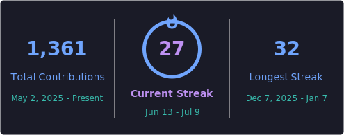

  <h2> Nice to meet you, I'm Static! ⚡ </h2>
  <h2><b> About Me </b></h2>

  

    <h3> My Role </h3>
    
 I'm a Full-Stack <b>(Backend-Leaning)</b> developer with a passion for cross platform software! 

  

  

    <h3> My Life </h3>
    
 
      I have dedicated myself to the betterment of not only myself, but everyone I interact with regularly. 
      This led me to contribute to multiple open source projects and work with various non-profits.   
      When I'm not volunteering, you'll find me researching a plethora of topics in both cybersecurity and philosophy. 
      I am always looking to learn, improve, and grow in all aspects of my life!
    

  

  

 

  <h3>Main Tech Stack</h3>

| Operating Systems | Staging & Deployment | Cross Platform Development | Databases |
| :---: | :---: | :---: | :---: |
|  |  |  |  |

 

  <h2>Additional Stacks</h2>
    
For a list of technologies I am familiar with but use less frequently, you can click 
      <a href="./NICHE.md">here</a>
    

 

  <h2>My Projects</h2>
    
A detailed overview of my projects can be found
      <a href="https://github.com/Static-Codes?tab=repositories">here</a>
    

 

  <h2>📊 GitHub Stats & Activity</h2>
  

  

  

 

  <h2>Let's Connect! ⚡</h2>
  

    
  

