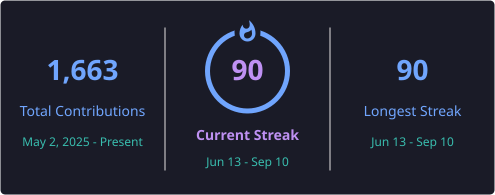

  <h1> Nice to meet you, I'm Static! </h1>
  <ul>
    <li> I'm a Full-Stack Engineer (<strong>Backend leaning</strong>) with a passion for creating user-facing applications & internal developer tooling that make lives easier.</li>
    <li> I primarily work on open-source and non-profit ventures, but have done engineering work in fintech, B2B/B2C sales, and contact development over the last decade. </li>
  </ul>
  

  <h2>📊 My Activity </h2>
  

    
    
  

  <h2>Let's Connect! ⚡</h2>
  

    
  

